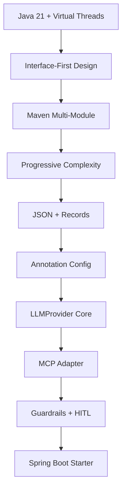

# Architecture Decision Records

This directory contains Architecture Decision Records (ADRs) for the Agenor project. ADRs are documents that capture important architectural decisions made during the development of the project, along with their context and consequences.

## ADR Index

| #                                                                   | Title                                    | Status   | Date       |
|---------------------------------------------------------------------|------------------------------------------|----------|------------|
| [ADR-001](ADR-001-use-java-21-with-virtual-threads.md)              | Use Java 21 with Virtual Threads         | Accepted | 2025-09-16 |
| [ADR-002](ADR-002-interface-first-architecture.md)                  | Interface-First Architecture             | Accepted | 2025-09-16 |
| [ADR-003](ADR-003-maven-multi-module-structure.md)                  | Maven Multi-Module Structure             | Accepted | 2025-09-16 |
| [ADR-004](ADR-004-progressive-complexity-strategy.md)               | Progressive Complexity Strategy          | Accepted | 2025-09-16 |
| [ADR-005](ADR-005-json-message-format-with-records.md)              | JSON Message Format with Records         | Accepted | 2025-09-16 |
| [ADR-006](ADR-006-annotation-based-agent-configuration.md)          | Annotation-Based Agent Configuration     | Accepted | 2025-09-16 |
| [ADR-007](ADR-007-llm-core.md)                                      | LLMProvider as Core Interface            | Accepted | 2025-11-04 |
| [ADR-008](ADR-008-WebConsole-Interface-First.md)                    | WebConsole Interface-First Design        | Accepted | 2025-11-26 |
| [ADR-009](ADR-009-agent-dialogue-protocol.md)                       | Agent Dialogue Protocol                  | Accepted | 2025-12-13 |
| [ADR-010](ADR-010-llm-memory-management.md)                         | LLM Memory Management                    | Accepted | 2025-12-23 |
| [ADR-011](ADR-011-knowledge-store-core.md)                          | KnowledgeStore as Core Interface         | Accepted | 2026-03-05 |
| [ADR-012](ADR-012-reflection-behavior.md)                           | ReflectionStrategy as Core Interface     | Accepted | 2026-03-12 |
| [ADR-013](ADR-013-mcp-adapter.md)                                   | MCP Adapter                              | Accepted | 2026-03-16 |
| [ADR-014](ADR-014-guardrails-layer.md)                              | Guardrails Layer                         | Accepted | 2026-03-23 |
| [ADR-015](ADR-015-hitl-checkpoint.md)                               | Human-in-the-Loop Checkpoint             | Accepted | 2026-03-24 |
| [ADR-016](ADR-016-spring-boot-starter.md)                           | Spring Boot Starter Module               | Proposed | 2026-03-26 |
| [ADR-017](ADR-017-llmrequest-model-optional.md)                     | LLMRequest model field — optional        | Accepted | 2026-04-12 |
| [ADR-018](ADR-018-optional-adapter-dependencies-pattern.md)         | Optional Adapter Dependencies Pattern    | Accepted | 2026-04-23 |
| [ADR-019](ADR-019-opentelemetry-instrumentation.md)                 | OpenTelemetry Instrumentation            | Accepted | 2026-04-23 |
| [ADR-020](ADR-020-core-api-refactor.md)                             | Core API Refactor for Distributed Backends | Accepted | 2026-04-26 |
| [ADR-021](ADR-021-redis-message-transport.md)                       | Redis MessageTransport — Pub/Sub vs Streams | Accepted | 2026-05-10 |
| [ADR-022](ADR-022-adapters-persistence-module-split.md)             | `agenor-adapters-persistence` Module Split  | Accepted | 2026-05-17 |
| [ADR-023](ADR-023-persistent-agent-directory-jdbc.md)               | Persistent Agent Directory with JDBC        | Accepted | 2026-05-17 |
| [ADR-024](ADR-024-persistent-hitl-approval-queue.md)               | Persistent HITL Approval Queue (JDBC)       | Accepted | 2026-05-22 |
| [ADR-025](ADR-025-agenor-rebrand.md)                                | Agenor Rebrand — Naming, Compat, Versioning | Accepted | 2026-05-28 |
| [ADR-026](ADR-026-request-protocol-final-resolution.md)            | REQUEST Protocol Final-Resolution Semantics | Accepted | 2026-07-23 |

---

## How to Use This ADR Collection

### For Developers

1. **Before Making Architectural Changes**: Read relevant ADRs to understand current decisions
2. **When Proposing Changes**: Create new ADR or update existing one
3. **During Code Reviews**: Reference ADRs to justify architectural choices
4. **When Onboarding**: ADRs provide context for why things are built this way

### For Contributors

1. **Understanding Decisions**: ADRs explain the "why" behind architectural choices
2. **Proposing Alternatives**: Create ADR to document alternative approaches
3. **Maintaining Consistency**: Use ADRs to ensure consistent decision-making

### ADR Lifecycle

1. **Proposed**: New ADR under discussion
2. **Accepted**: Decision made and implemented
3. **Deprecated**: Superseded by newer decision
4. **Rejected**: Considered but not adopted

## ADR Template

When creating new ADRs, use this template:

```markdown
# ADR-XXX: [Title]

**Status**: [Proposed/Accepted/Deprecated/Rejected]  
**Date**: YYYY-MM-DD  
**Last Modified**: YYYY-MM-DD
**Authors**: [List of authors]  
**Replaces**: [ADR number if replacing an existing decision]  
**Replaced By**: [ADR number if this decision was superseded]  

## Context

[Describe the forces at play, including technological, political, social, and project local.]

## Decision

[State the architecture decision and provide rationale.]

## Rationale

### Pros
- [List benefits of this approach]

### Cons  
- [List drawbacks and trade-offs]

### Alternatives Considered
- **Alternative 1**: [Brief description and why it was rejected]
- **Alternative 2**: [Brief description and why it was rejected]

## Implementation

[Provide concrete examples, code snippets, or configuration that demonstrates the decision.]

## Consequences

### Positive
- [List positive consequences]

### Negative
- [List negative consequences]

### Neutral
- [List neutral consequences]

## Compliance

[How will adherence to this decision be monitored and enforced?]

## Notes

[Any additional notes, references, or related information]
```

---

## Future ADRs

New ADRs will be created when architectural decisions are needed. ADRs are created on-demand,
not planned in advance, to maintain flexibility and avoid premature commitments.

When a new architectural decision is required:
1. Assess if it warrants an ADR (significant impact, affects multiple components, long-term implications)
2. Create the ADR using the template above
3. Discuss with the team and stakeholders
4. Update this index when the ADR is accepted

---

## Decision History

### Major Architectural Phases

**Phase 1 - Foundation**
- Established core technology choices
- Defined modular architecture
- Set development principles

**Phase 2 - Implementation**
- Define implementation standards
- Establish quality practices
- Set operational guidelines

**Phase 3 - Enterprise**
- Advanced features and extensibility
- Production-ready capabilities
- Enterprise integration patterns (Spring Boot starter, HITL, Guardrails)

### Technology Evolution



### Decision Dependencies

- **ADR-001** (Java 21) enables **ADR-005** (Records)
- **ADR-002** (Interfaces) enables **ADR-004** (Progressive Complexity)
- **ADR-003** (Maven Modules) supports **ADR-002** (Interface Architecture)
- **ADR-006** (Annotations) builds on **ADR-005** (Message Format)
- **ADR-015** (HITL) builds on ADR-001, ADR-005, ADR-006, ADR-014
- **ADR-016** (Spring Boot Starter) builds on ADR-003, ADR-004, ADR-007
- **ADR-017** (LLMRequest optional model) refines ADR-007 (LLMProvider as Core Interface)
- **ADR-018** (Optional Adapter Deps) governs ADR-019 and future adapter ADRs
- **ADR-019** (OTel Instrumentation) builds on ADR-002, ADR-003, ADR-018
- **ADR-020** (Core API Refactor) builds on ADR-002, ADR-004; prerequisite for ADR-021, ADR-022, ADR-023
- **ADR-021** (Redis MessageTransport) builds on ADR-001, ADR-018, ADR-020
- **ADR-022** (`agenor-adapters-persistence` Module Split) builds on ADR-003, ADR-004, ADR-018, ADR-020; prerequisite for ADR-023, ADR-024
- **ADR-023** (Persistent Agent Directory with JDBC) builds on ADR-001, ADR-002, ADR-019, ADR-020, ADR-022
- **ADR-024** (Persistent HITL Approval Queue) builds on ADR-001, ADR-004, ADR-015, ADR-022, ADR-023
- **ADR-025** (Agenor Rebrand) builds on ADR-002, ADR-003, ADR-006, ADR-016, ADR-020 — affects naming and Maven coordinates for the entire project
- **ADR-026** (REQUEST Protocol Final-Resolution Semantics) resolves the "Known Limitations" gap left open by ADR-009

---

## References and Further Reading

### External Resources

- [Architecture Decision Records (ADRs)](https://adr.github.io/)
- [Java 21 Documentation](https://docs.oracle.com/en/java/javase/21/)
- [Project Loom Documentation](https://openjdk.org/projects/loom/)
- [Maven Multi-Module Best Practices](https://maven.apache.org/guides/mini/guide-multiple-modules.html)
- [Spring Boot Auto-configuration](https://docs.spring.io/spring-boot/reference/using/auto-configuration.html)

### Related Projects

- [JADE Framework](https://jade.tilab.com/) - Original inspiration
- [Spring Framework](https://spring.io/) - Architecture patterns
- [Akka](https://akka.io/) - Actor model implementation
- [Vert.x](https://vertx.io/) - Reactive applications

### Internal Documentation

- [Architecture Overview](../architecture.md)
- [Agent Development Guide](../agent-development.md)
- [Configuration Reference](../configuration.md)

---

> **Note**: ADRs are living documents. As Agenor evolves, these decisions may be revisited and updated.
> Always check the status and date of each ADR to ensure you're working with current architectural decisions.
